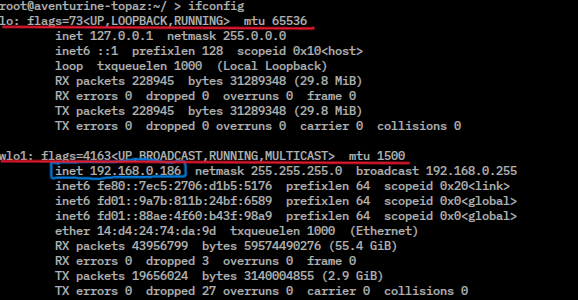

# Servidor-MC
Instrucciones para preparar un servidor de minecraft en linux

Antes de nada, estas instrucciones están preparadas para el montaje en un sistema "linux", en mi caso se va a montar en una Raspberri Pi 5, por lo que usaremos "ssh" para conectarnos de fora cómoda.

Trabajaremos con las opciones básicas a su vez que podremos gestionar algunos errores referentes a java y preparar scripts para poder modificar, apagar y encender el servidor de forma remota
```
.
├── 📄 README.md                <-- Guía rápida e índice
├── 📄 .gitignore              <-- Archivos a excluir (logs, mundos)
├── 📄 eula.txt                <-- Aceptación de la EULA (EULA=true)
├── ⚙️ start.sh                <-- Script de inicio para Linux/Mac
├── 📁 config/                 <-- Plantillas de configuración
│   ├── 🔧 server.properties  <-- Configuración principal
```

## Descarga del servidor
Se tiene que descargar desde la página oficial de mojang, ya sea buscando "minecraft server mojang" o aquí -> https://www.minecraft.net/es-es/download/server

## Inatalación java
Tenemos que instalar la versión correcta de java. Para ver la versión instalada simplemente hacemos
```java --version```

En nuestro caso vamos a instalar java 25, ya que a fecha de creación de este repositorio no se puede instalar java 25 de forma cómoda, lo haremos delegando en otro repositorio
```
sudo apt update
sudo apt install -y wget apt-transport-https gpg
wget -qO - https://packages.adoptium.net/artifactory/api/gpg/key/public | sudo gpg --dearmor -o /usr/share/keyrings/adoptium.gpg

sudo apt update
sudo apt install temurin-25-jdk
```

## Arranque inicial del servidor
Ahora con java configurado, procedemos a arrancar el servidor previamente descargado [Miencraft Server](https://www.minecraft.net/es-es/download/server)

```
java -Xmx4G -Xms4G -jar minecraft_server.26.3.jar nogui
```

Vamos a separar este comando en varias partes:
* -Xmx4G: Significa la ram **máxima** que queremos darle al servidor expresada en Gigabytes (en este caso 4)
* -Xms4G: Significa la ram **minima** que queremos darle al servidor expresada en Gigabytes (en este caso 4)
* -jar: Opciones para indicarle que es un archivo .jar
* minecraft_server.26.3.jar: El nombre del servidor (el archivo)
* nogui: Sin interfaz gráfica, solo terminal

Si quisieramos por ejemplo ponerle 6 Gigabytes de ram mínima y 8 Gigabytes de ram máxima (expresados en MegaBytes ambos), y el archivo se llamara "server.jar" usaríamos el siguiente comando

```
java -Xmx8192M -Xms6144M -jar server.jar nogui
```
Que es igual que

```
java -Xmx8G -Xms6G -jar server.jar nogui
```

## Error Java comun (saltar si no da error)

Si tras hacer el comando anterior nos salta un error de este tipo:

```
Error: Se ha producido un error de enlace al cargar la clase principal net.minecraft.bundler.Main
    java.lang.UnsupportedClassVersionError: net/minecraft/bundler/Main
    has been compiled by a **more recent version of the Java** Runtime (**class file version 69.0**),
    this version of the Java Runtime only recognizes class file versions up to 65.0

```

Con lo de "more recent version of Java" deducimos que tenemos una versión más antigua
Con lo de "class file version 69.0" y una pequeña búsqueda, descubrimos que necesitamos Java 25 para estos archivos

Significa que necesitamos una versión mas moderna de Java, la solución sería buscar por Internet como descargar la versión necesaria y estaría arreglado.

## Arranque servidor

Tras realizar el comando de antes por primera vez sin errores, se nos crearán varios archivos

```
java -Xmx4G -Xms4G -jar minecraft_server.26.3.jar nogui
```

1) El servidor se cerrará y tendrás que aceptar/activar "eula". Dentro de los archivos creados es cambiar un campo de "false" a "true", estos cambios los haremos con "nano" pero se pueden hacer con cualquier editor de texto, la aclaración es por si hace falta la instrucción inicial para como salir de la edición de "nano" :)

```
nano eula.txt

("Ctrl + X" para salir, "Y" para decirle que se guarde, "enter" para que se quede con el nombre)
```

2) Una vez cambiado y guardado el archivo, arrancamos de nuevo el servidor (java -Xmx...). El servidor se abrirá y se crearán los archivos necesarios para su funcionamiento. Entre los archivos creados hay uno llamado "server.properties", en este repositorio he puesto uno de prueba (el oficial hasta la fecha) para poder verlo

En este archivo es donde se hacen las modificaciones del mundo (hay que reiniciar el servidor para que se apliquen), dificultad de la partida, pvp, altura max, whitelist y blacklist, etc...
A su vez encontraremos las opciones necesarias de Ip, rcon y demás para poder configurarlo para la conexión

3) Ahora mismo el servidor está operativo y listo para entrar **estando en la red Local**, pero queremos que se pueda conectar cualquiera desde donde sea, para lo cual usaremos una VPN a elegir por el usuario (todos los jugadores la misma, al igual que la del servidor) Hamachi, RadminVPN...

4) Con esto listo (lo puede probar primero el que hace el servidor en local sin vpn para ver que todo funciona), se abre el cliente de Minecraft en la versión especificada en la que se ha creado.
Añadir servidor:
    - Nombre: Indiferente
    - IP: La ip de la máquina donde se ejecute, como se mira esto, al estar en linux, se usa el comando
    ```
    ifconfig
    ```
    